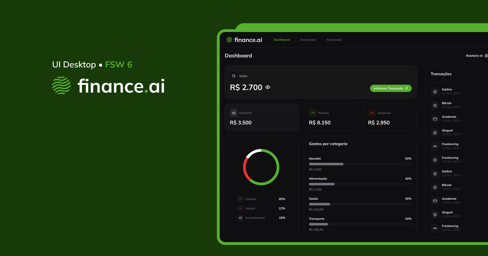

  
  

## About

**finance.ai** is a projet built on an online programming event called **FullStack Week (FSW)**. The Figma file with all the features were provided by FSW team and all credits for UI goes them.

The original project API was built with Next.js and Prisma. My goal here is to architect and document my own version using more advanced topics like:

- 🤖 Automated tests;
- 📚 API documentation;
- ✨ Clean architecture;
- 🚀 CI/CD pipelines;
- 🏠 Local workflow like commitlint, etc.;

This repository contains all the code and configurations related to backend. Frontend dashboard will be hosted on another repository.
